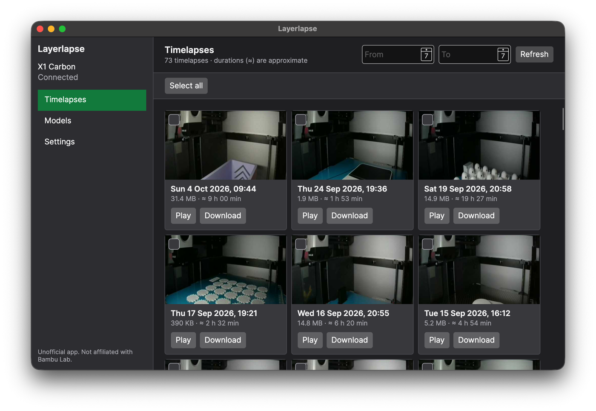
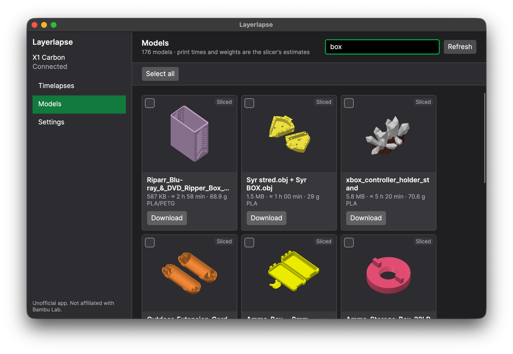
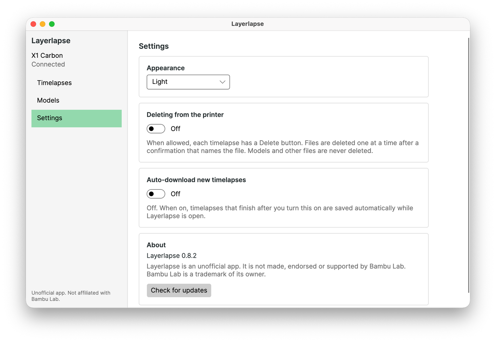
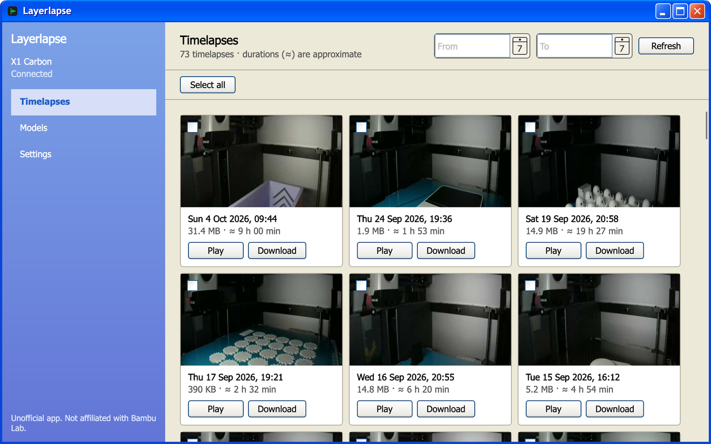

# Layerlapse

An unofficial desktop app for macOS, Windows and Linux that finds a Bambu Lab printer on your local network and
lets you browse, play and download its timelapses and models, without a phone or Bambu Studio.

> Layerlapse is not made, endorsed or supported by Bambu Lab. "Bambu Lab" is a trademark of its owner.

[](https://github.com/ziggy46/Layerlapse/releases/latest)

## Download

[](https://github.com/ziggy46/Layerlapse/releases/latest/download/Layerlapse-win-x64-setup.exe)
[](https://github.com/ziggy46/Layerlapse/releases/latest/download/Layerlapse-osx-arm64.dmg)
[](https://github.com/ziggy46/Layerlapse/releases/latest/download/Layerlapse-osx-x64.dmg)
[](https://github.com/ziggy46/Layerlapse/releases/latest/download/Layerlapse-linux-x64.tar.gz)

Each button downloads the newest release. Windows also has a
[portable zip](https://github.com/ziggy46/Layerlapse/releases/latest/download/Layerlapse-win-x64-portable.zip),
and every version is on the [releases page](https://github.com/ziggy46/Layerlapse/releases).

## Screenshots



| Models, with previews read from inside each file | Settings in the Light theme |
| --- | --- |
|  |  |

**Windows XP theme (Windows only):**



## What it does

- **Finds your printer** from its network announcements, or by scanning the local network on request, or by IP
  address. Shows its model, name, serial and firmware.
- **Remembers the access code** in the system's password store (macOS Keychain, Windows Credential Manager,
  Linux Secret Service) and reconnects at launch. The printer's certificate is pinned on first connect, and the
  app warns if it changes.
- **Timelapses:** a grid with thumbnails, start time, size and approximate print time, newest first, with a
  date filter. Plays inside the app on macOS (other systems use the default video player).
- **Models:** every `.3mf` project on the printer, with its preview, the slicer's print time, weight and
  filament, search by name, and "Open in Bambu Studio" after downloading. Previews are read from inside the
  files without downloading them.
- **Downloads** of one or many files, with progress and cancel. Interrupted downloads continue where they
  stopped, and files already in the folder are skipped.
- **Extras:** storage used on the printer, auto-download of new timelapses while the app is open, several
  saved printers, and an update check that links to the release page.
- **Themes:** Dark (default) and Light everywhere, plus a **Windows XP** theme on Windows, with its own blue
  title bar (look inspired by [XP.css](https://github.com/botoxparty/XP.css), MIT).

Layerlapse is read-only by default. Deleting is limited to timelapses, off unless you turn it on in Settings,
and asks for confirmation each time. It never touches models, certificates or other files on the printer.

## Requirements

- A Bambu Lab printer on the same local network. Developed and tested with an X1 Carbon (firmware
  01.12.00.00); other models use the same protocol but have not been tested.
- The printer's **access code**: on the printer screen, Settings, then LAN Only Mode. LAN Only Mode does not
  need to be switched on.
- macOS 12 or later, Windows 10 or later, or a 64-bit Linux desktop.

## Install

- **Windows:** run `Layerlapse-win-x64-setup.exe`. It installs for your user only (no administrator rights),
  adds a Start menu entry and an uninstaller. The portable `.zip` runs without installing.
- **macOS:** open the `.dmg` for Apple Silicon (`osx-arm64`) or Intel (`osx-x64`) and drag Layerlapse to
  Applications.
- **Linux:** extract the `.tar.gz` and run `Layerlapse`.

Builds are not signed yet:
- **macOS:** the first time, right-click the app and choose Open. macOS asks for Keychain access after each
  update; choose Always Allow.
- **Windows:** SmartScreen may warn about an unknown publisher; choose More info, then Run anyway.

## Build from source

Needs the [.NET 10 SDK](https://dotnet.microsoft.com/download).

```bash
dotnet build Layerlapse.sln
dotnet run --project src/Layerlapse.App
dotnet test Layerlapse.sln
```

Tests that talk to a real printer run only when `LAYERLAPSE_IP` and `LAYERLAPSE_CODE` are set, and the
57 MB download test also needs `LAYERLAPSE_HEAVY_TESTS=1`. Never commit or share your access code.

## How it works

Bambu Lab printers serve their storage over implicit FTPS (TLS on port 990) and require every data connection
to resume the control connection's TLS session. .NET's built-in TLS cannot do that, so Layerlapse uses
BouncyCastle's managed TLS with a small read-only FTP client. The details, with the commands that proved them,
are in [docs/FINDINGS.md](docs/FINDINGS.md), and the build plan is in [PLAN.md](PLAN.md).

## Licence

[MIT](LICENSE)
